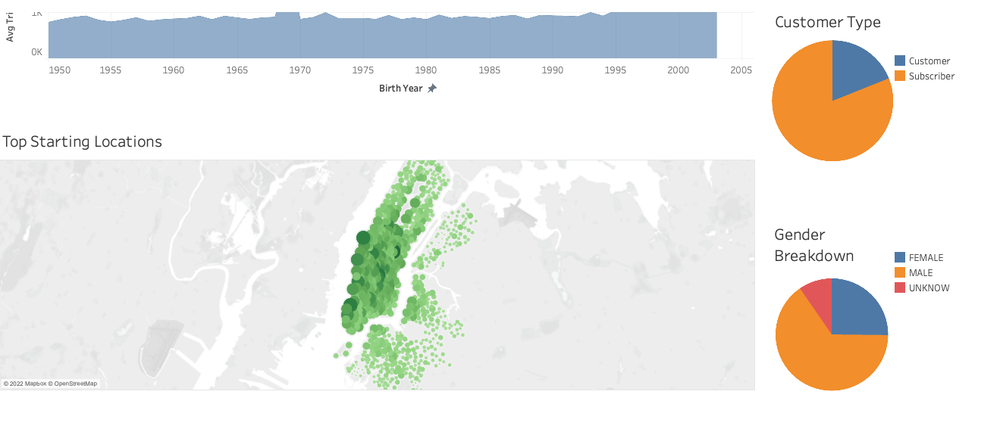
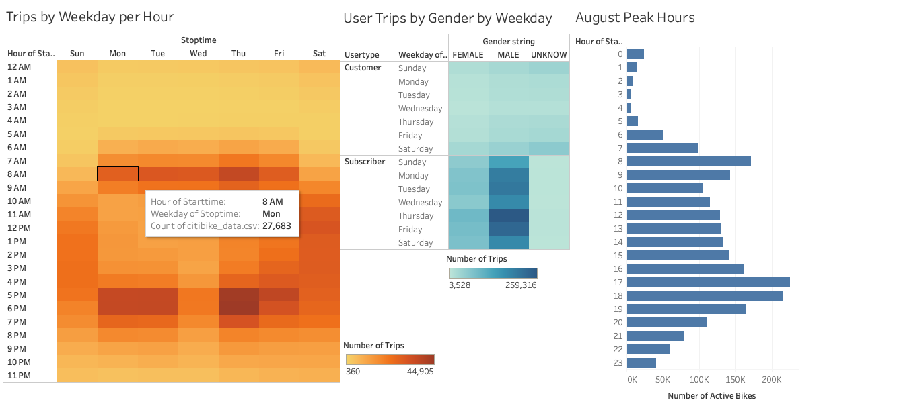
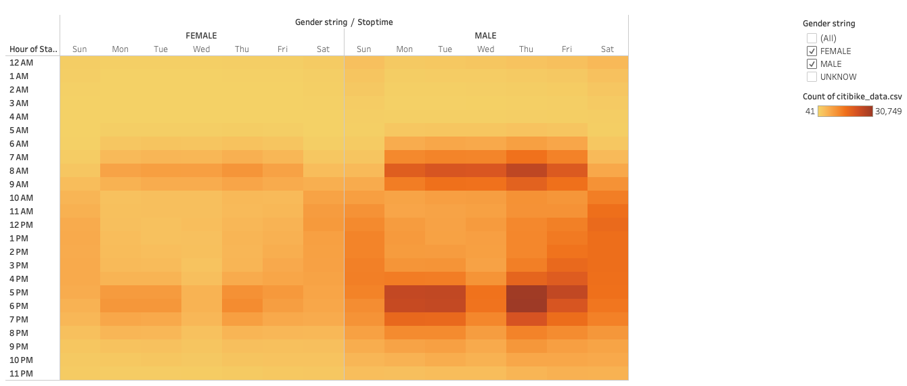

# Bikesharing Analysis

## 1. Overview of the Bikesharing Analysis

This project is an analysis of New York Citi Bike data, using Tableu data visualization tool to explore the viability of a bike-sharing business

## 2. Results:

### 2.1 New York Citi Bike data visualizations for August 2019

  

* There were over 2.3 million rides for the month of August 2019.
* 81% of the users were subscribers. 65% of the users were confirmed males and 25% were confirmed females.
* There is a wide range of the age of the users. Younger users tend to use the service for longer rides.
* Top ride starting locations are in the most touristic and busy areas, as we see here in Manhattan.

### 2.2  Checkout Times for Users and by Gender

  

* Bikes are mostly checked out for 4 to 6 hours.
* Male users take approximately 3 times more rides than the female users.

### 2.3 Trips by Weekday and Gender

  

  

* Highest activity hours are from 5:00 PM to 7:00 PM and require the most resources mobilized.
* The activity from 2:00 AM to 5:00 AM is low so this would be the window for bike maintenance.
* Most weekday rides are around 7:00 AM to 9 AM and 5:00 PM to 7:00 PM.
* Weekend rides are highest from 10:00 AM to 7:00 PM.
* Those rides are mostly taken by male users.

## 3.Summary

The data shows high activity of the bike sharing service in New York during the month of August 2019.
The far majority of the rides were in the very busy Manhattan Island, taken by male users during morning and evening rush hours. This implies that Citi Bike services are used as an alternative to public transportation by commuting workers.

[Link to dashboard](https://public.tableau.com/app/profile/noelia.vasquez/viz/NYCCitiBike_16602357996520/Story1)
